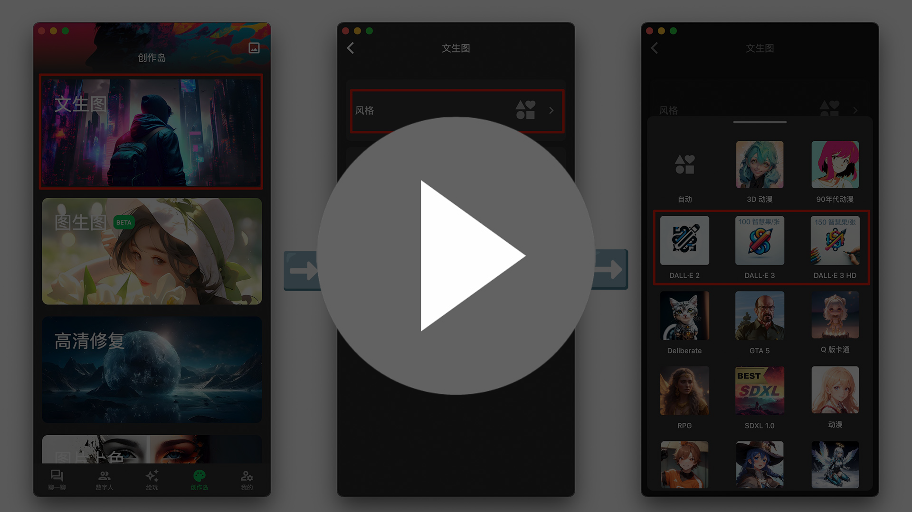
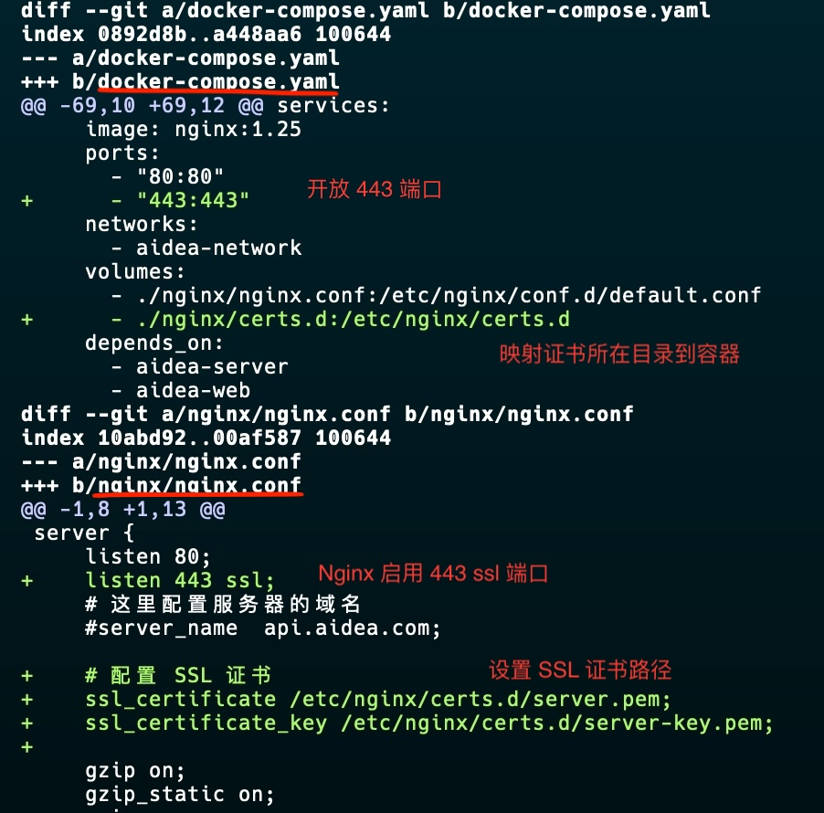

# AIdea 一键部署安装包 - AI 聊天、协作、图像生成

本项目为 AIdea 项目的一键部署安装包，基于 docker compose。

AIdea 是一款集成了主流大语言模型以及绘图模型的 APP，代码完全开源，支持以下功能：

- 支持 OpenAI 的 GPT-3.5，GPT-4 大语言模型
- 支持 Anthropic 的 Claude instant，Claude 2.0 大语言模型
- 支持国产模型：通义千问，文心一言，讯飞星火，商汤日日新，腾讯混元，百川53B，360智脑
- 支持开源大模型：Llama2，ChatGLM2，AquilaChat 7B，Bloomz 7B 等，后续还将开放更多
- 支持文生图、图生图、超分辨率、黑白图片上色等功能，集成 Stable Diffusion 模型，支持 SDXL 1.0

下载体验地址：

https://aidea.aicode.cc

开源代码：

- 客户端：https://github.com/mylxsw/aidea
- 服务端：https://github.com/mylxsw/aidea-server
- Docker 部署：https://github.com/mylxsw/aidea-docker


### 使用说明

在启动项目之前，请先根据自己的需要修改 `etc/config.yaml` 文件，该文件为 AIdea 服务端的配置文件。

> 如修改 OpenAI以及各种其它模型服务的 API Keys、邮箱 SMTP 信息、七牛云存储配置、短信、支付配置等，项目依赖参考 [部署指南](https://github.com/mylxsw/aidea-server/blob/main/docs/deploy.md#%E9%A1%B9%E7%9B%AE%E4%BE%9D%E8%B5%96)。
>
> 尝鲜只需要修改 `openai-servers` 和 `openai-keys` 即可使用 GPT 模型进行聊天。

运行前请先确保已安装好 Docker 环境和安装有 docker-compose 命令。

> 比如在 CentOS 系统下，通过以下命令安装 Docker 环境
> 
> ```bash
> # 设置 docker yum 源
> yum install -y yum-utils
> yum-config-manager --add-repo https://download.docker.com/linux/centos/docker-ce.repo
> 
> # 安装 docker 社区版、docker-compose 等
> yum install docker-ce docker-ce-cli containerd.io \
>     docker-buildx-plugin docker-compose-plugin -y
>
> # 启动 docker 服务
> systemctl enable docker
> systemctl start docker
> ```

执行下面的命令启动 AIdea 环境

```bash
docker-compose up
```

[](https://player.bilibili.com/player.html?aid=236534307&bvid=BV14e411Z7wG&cid=1348699022&p=1)

以下为常用的命令

```bash
# 启动服务（前台运行）
docker-compose up

# 启动服务（后台运行）
docker-compose up -d

# 停止服务
docker-compose down

# 清空所有数据
rm -fr mysql redis && mkdir -p mysql redis

# 访问数据库
docker exec -it aidea-docker-mysql-server-1 mysql -uroot -p
```

### 常见问题

- 如何修改初始默认数据库、Redis 密码？
    1. 复制 `.env.example` 文件为 `.env` 文件，然后在该文件中修改密码
    2. 在 `etc/config.yaml` 文件中，修改 `db-uri` 和 `redis-password` 配置项为修改后的密码

- 如何升级为最新镜像？
    1. 复制 `.env.example` 文件为 `.env` 文件
    2. 修改 `AIDEA_WEB_IMAGE` 和 `AIDEA_SERVER_IMAGE` 为最新镜像名称

- 如何自己打包镜像？
    - 服务端镜像打包参考：[mylxsw/aidea-server:docker-build.sh](https://github.com/mylxsw/aidea-server/blob/main/docker-build.sh)
    - 客户端镜像打包参考：[mylxsw/aidea:docker-build.sh](https://github.com/mylxsw/aidea/blob/main/docker-build.sh)

- 在哪里看最新版的镜像？
    - 服务端镜像：[mylxsw/aidea-server](https://hub.docker.com/r/mylxsw/aidea-server)
    - 客户端镜像：[mylxsw/aidea-web](https://hub.docker.com/r/mylxsw/aidea-web)

- 如何打包客户端 Android/iOS/macOS/Win 客户端？

    参考这里：[AIdea 项目开发环境部署教程（一）前端 Flutter 环境搭建](https://mp.weixin.qq.com/s?__biz=MzA3NTU1NDk4Mg==&mid=2454663555&idx=1&sn=8641dd19b37ef6b9805217a6f10faeda&chksm=88d5584abfa2d15cd08ff790ba9fd5444408f73343b3cceeee93cf91248e660f04bb6fd8d3eb&scene=178&cur_album_id=3204997940193296389#rd)。

- 如何使用内置的 Nginx 启用 HTTPS？

    将你的 HTTPS 的域名证书文件复制到 `nginx/certs.d` 目录（注意：该目录中已有的证书文件仅供演示使用，请替换为你自己的），然后做如下修改

    
    
- 如何修改端口？

  一般场景下，只有下图中的三处可能涉及到修改，其它位置如果不是很熟悉 Docker 的话，最好不要乱动。

    


### 技术交流

- 微信技术交流群：3 个群都已满员，添加微信号 `x-prometheus` 为好友，拉你进群

    

- 微信公众号

    

- 电报群：[点此加入](https://t.me/aideachat)

## APP 预览图

亮色系


暗色系


## Star History

<a href="https://star-history.com/#mylxsw/aidea-docker">
  <picture>
    <source media="(prefers-color-scheme: dark)" srcset="https://api.star-history.com/svg?repos=mylxsw/aidea-docker&type=Date&theme=dark" />
    <source media="(prefers-color-scheme: light)" srcset="https://api.star-history.com/svg?repos=mylxsw/aidea-docker&type=Date" />
    
  </picture>
</a>

## License

MIT

Copyright (c) 2023, mylxsw
